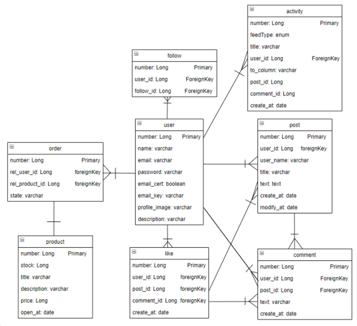
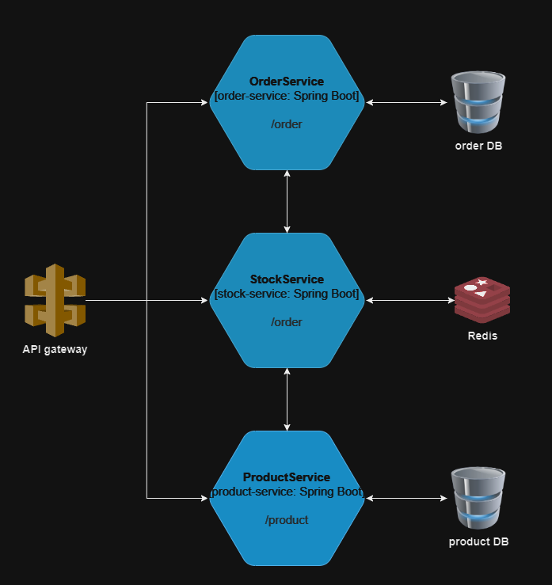

# 예약 구매 서비스

## 1. 개요
이 서비스는 사용자들이 이웃들과 소통하고 쇼핑을 즐기며 편리하게 예약 구매를 할 수 있는 플랫폼을 제공합니다

 

## 2. 이용 안내
### - API 문서
https://dull-apogee-965.notion.site/6df35cdb93dd43939d1c37b998f14074?v=d1df5713b5fa4a5ebab5903050405d7f&pvs=4

 

## 3. 구성
### - UserService 모듈
- 회원가입, 내 정보 변경 등 회원 관리 API 모듈
### - ActivityService 모듈
- 포스팅, 댓글, 좋아요, 팔로우 등 SNS 활동 API 모듈
### - NewsFeedService 모듈
- 뉴스피드 읽기, 검색 API 모듈

 

## 4. 시스템 설계
### - ERD

### - 소프트웨어 아키텍처

 

## 5. 기술 특장점
### - Kafka를 활용한 이벤트 기반 아키텍처
OrderService msa는 Apache Kafka를 활용한 이벤트 기반 아키텍처를 채택했습니다.
Kafka의 메시지 큐 시스템은 높은 처리량과 낮은 지연 시간을 제공하여 실시간 데이터 스트림 처리에 적합합니다.
따라서, 사용자들은 즉각적인 이벤트 업데이트를 받을 수 있으며, 시스템은 확장성과 유연성을 유지할 수 있습니다.

### - Redis를 활용한 실시간 재고 확인 서비스
실시간 재고 확인 기능은 서비스의 핵심 기능 중 하나입니다.
이를 위해 Redis를 선택하여 신속한 응답 시간과 확장 가능한 재고 관리 시스템을 구축했습니다.
Redis의 인메모리 데이터 저장 방식은 매우 빠른 읽기 및 쓰기 속도를 제공하여 고객이 제품의 재고 상태를 즉시 확인할 수 있습니다.
 

## 6. HOW TO RUN
### - 개발 환경

Java : 17 
Spring Boot : 3.2.2 
DockerVersion : 3.9
MySQL : 8.0.31

### - UserService Build
1. cd /UserService
2. ./gradlew build
### - NewsFeedService Build
1. cd /NewsFeedService
2. ./gradlew build
### - ActivityService Build
1. cd /ActivityService
2. ./gradlew build
### - docker-compose 시작
1. docker-compose up

### - Test 코드 실행 (주문 시도 1만회)
**테스트 코드는 테스트 하고자 하는 API 주소로 변경 해서 테스트 !** 
1. docker build -t http_request_tool .
2. docker run http_request_tool
